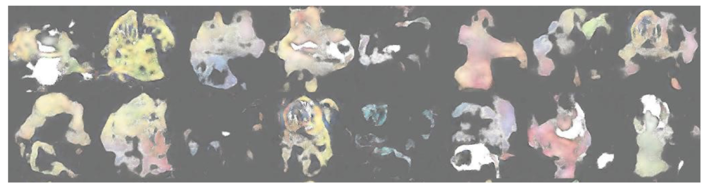

# Pokemon Generator
### - A Deep Learning Model implemented with [Wasserstein GAN](https://arxiv.org/abs/1701.07875v3)
---
## Methods

### Data Preparation
Raw data for the experiment are 819 256x256 .png pokemon images retrieved from the [Kaggle platform](https://www.kaggle.com/kvpratama/pokemon-images-dataset)

The process of augmentations is as follows:

1. process the orignial image into 128x128 .jpg with black background

2. augment using 4 different methods

-
### Neural Network Design

#### Discriminator (5 layers)
- First layer: A convolution layer with filter size 64, kernel size 5x5 and 2x2 stride; A batch normalization layer and a leaky relu activation layer.
- Second: A convolution layer with filter size 128, rest are the same as the first set of layers.
- Third: A convolution layer with filter size 256, rest are the same as the first set of layers.
- Fourth: A convolution layer with filter size 512, rest are the same as the first set of layers.
- Fifth: Only a readout layer, the details are in the code delivered.

#### Generator (6 layers)
- First set: A read-in layer for the input (10 dimensional random vectors), reshaping the input into a 4x4x512 tensor, followed by a batch normaliza- tion layer and a leaky relu activation layer
- Second: A transposed convolution layer with filter size 256, kernel size 5x5 and 2x2 stride, a batch normalization layer and a leaky relu activation layer.
- Third: A transposed convolution layer with filter size 128, rest are the same.
- Fourth: A transposed convolution layer with filter size 64, rest are the same.
- Fifth: A transposed convolution layer with filter size 32, rest are the same.
- Sixth: A transposed convolution layer with filter size 3, and compute hyperbolic tangent of the output

---

## Experiment Results

### Discriminator Capability
Test result of MNIST dataset on discrimnator (slightly modified)

Final accuracy is arround __98.5% to 99%__

-
### Results of differently augmented dataset

- Original

- Dataset = Original 819 images + Vertical Flipped 819 images + Horizontally flipped 819 images = 2457 images

- Dataset = Original 819 images + 1st set Random Cropped 819 images + 2st set Random Cropped 819 images = 2457 images

- Dataset = Original 819 images + Clockwise rotated 20 degrees 819 images + Anticlockwise rotated 819 images = 2457 images

- Dataset = Original 819 images + 1st set Random brightness and Contrast 819 images + 2st set random brightness and Contrast 819 images = 2457 images

- Dataset = Original 819 images + Vertical/Horizontally flipped 1638 images + Clockwise rotated 20/15/10/5 degrees 3276 images + Anticlockwise rotated 20/15/10/5 3276 images = 9009 images

